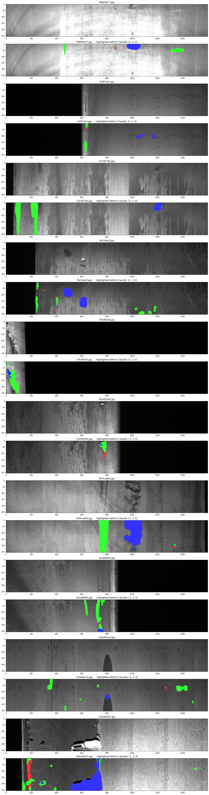

### Public-repo

Привет! Это одна из моих папочек с работами в открытом доступе.
Здесь Вы можете ознакомится с моими скилами.

#### 1_Pandas_Gender_Age_prediction_based_on_user_logs
    Выпускной проект от NewProLab, Специалист по большим данным 13,0
  
По имеющимся логам пользователей (id, url, timestamp) нужно предсказать пол и возраст
  
    Обучение с учителем на sklearn.  
    Фича: host, path, day, hour, std (по времени), min max (hour), counter (посещений) 
    Решение: Логиcтическая регрессия One-vs-rest
    Точность: 0,296 по Accuracy
    Хоть и пандас но сделан мультипроцессинг, потому считает быстро.
  
  
#### 2_Spark_cossim_text
    Учебный проект от NewProLab, Специалист по большим данным 13,0
  
По имеющимся данным портала eclass.cc построить content-based рекомендации по образовательным курсам.
  
    На Спарке ищем по косинусной близости 10 наиболее релевантных курсов к нашим id из задания по их описанию.
    Фича: текст описания, который преобразуем в корпус слов и дальше в спарс вектор
    Решение: ml.CountVectorizer или ml.HashingTF + своя UDF
    Точность: от 0,6 до 0,9 по Accuracy в зависимости от размера описания статьи.
  
  
#### 3_ALS_purchase_prediction
    Учебный проект от NewProLab, Специалист по большим данным 13,0
  
В вашем распоряжении имеется уже предобработанный и очищенный датасет с фактами покупок абонентами телепередач от компании E-Contenta. По доступным вам данным нужно предсказать вероятность покупки других передач этими, а, возможно, и другими абонентами.
  
    На Спарке, коллаборативная фильтрация user-item
    Фича: user-item таблица покупок
    Решение: За основу взят ml.ALS и подбор CV параметров ALS
    Точность: 0.792 по RMSE
  
  
#### 4_Spark_funk_SVD  
    Учебный проект от NewProLab, Специалист по большим данным 13,0
  
По имеющимся данным о рейтингах фильмов (MovieLens: 100 000 рейтингов) построить коллаборативную рекомендательную систему на основе коллаборативной фильтрации путём подсчёта базовых предикторов и создания с ними Item-Item Recommender System.
  
    На Спарке, коллаборативная фильтрация item-item 
    Фича: user-item таблица рейтингов
    Решение: За основу взят метод SVD с фиксацией предсказаний только для одного пользователя. 
             Соревнование на Каггл по нетфликсу. funk-SVD
    Точность: 0.931 по Accuracy

#### 5_Graph_social_network_recommendation_model
    Выпускной проект от NewProLab, Специалист по большим данным 13,0
  
Нужно построить content-based рекомендательный алгоритм товаров интернет-магазина ozon.ru наилучшей предсказательной точности по метрике NDCG@100.
  
    На Спарке, графовая модель 
    Фича: пары c общим мастер id 
    т.е. из {"item": "31471303", "true_recoms": {"31471373": 1, "31471307": 3, "31471342": 1}}
    делаем [31471373,31471307]
           [31471373,31471342]
           [31471307,31471342]
           ...
           [31471307, 31471373]
           [31471342, 31471373]
           [31471342, 31471307]
           полностью симметричный датасет со всеми комбинациями...
   
    Решение: За основу взят граф связей социальных сетей.
    Точность: 0,13, 10мин, одним проходом для всех 1 291 846 релевантных пар
  
    Решение в лоб 130 000 x 130 000 матрицы батчами по косинусной близости контекста занимает ~ 19 дней, точность 0,31 
    Решение c факторизацией оценок 130 000 x 130 000 матрицы батчами ~ 1 час 40 мин, 
        подбор параметров займет около недели, точность 0,19 

#### Jovian https://jovian.ai/novikov-ms-in12/zerogans-protein-competition
    Задание из курса Jovian: PyTorch Zero to Gans
    Одна из работ по определению белков в клетках
    
    Обучение с учителем
    Фича: картинка и лейбл
    Решение: pandas + numpy + PyTorch + CNN
    Точность: 0.79 косинусная близость

#### Kaggle https://www.kaggle.com/novikovmikhail/word2vec-evaluating-good-comments
    Одно из заданий NewProLab + Kaggle word2vec-nlp-tutorial 
    Определяем положительность комментариев к фильмам по датасету IMDb
    
    Пандас, обучение с учителем.
    Фича: таблица комментариев
    Решение: CountVectorizer + RandomForest
    Точность: 0.86 по ROC AUC

#### Kaggle https://www.kaggle.com/novikovmikhail/cnn-steel-defect-detection
    Самостоятельная работа по изучению Semantic segmentation на датасете от Северстали
    и сданая как квалификационная работа курса от Jovian: PyTorch Zero to Gans
   
    Обучение с учителем.
    Фича: размеченные маски к изображениям + изображения
    Решение: pandas + numpy + PyTorch + U-CNN
    Точность: Epoch: 7 | Loss: 0.0231 | F: 0.5274 | IoU: 0.4243 | Dice: 0.5274
    Лидерборд ~0.89 
    
    Для меня пока соревноваться смысла небыло, зато уже красиво выделяет дефекты по маске.

    

